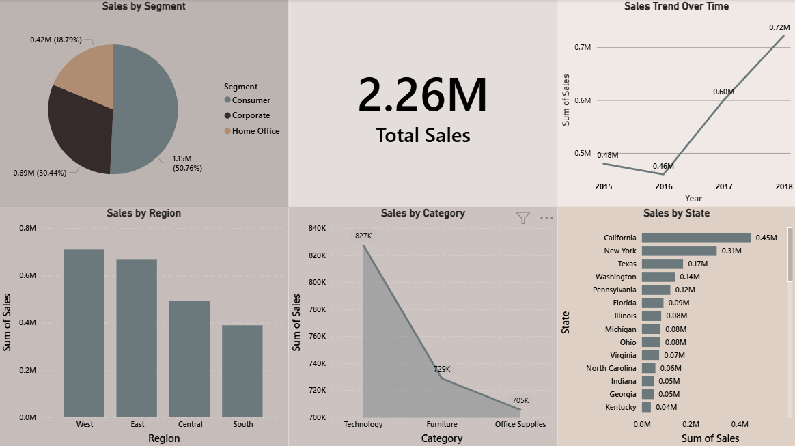

# 📊 Power BI Sales Dashboard

This project analyzes retail sales data and presents insights using an interactive Power BI dashboard.

---

## 📌 Steps Performed
- Data loading and basic cleaning in Power BI  
- Created KPI for total sales  
- Built visualizations for region, category, and segment analysis  
- Designed time-based sales trend analysis  
- Added slicer for interactive filtering  

---

## 📊 Visualizations

### Total Sales KPI
### Sales by Region
### Sales by Category
### Sales by State
### Sales Trend Over Time
### Sales by Segment

## Dashboard

---

## 🛠 Tools Used
- Power BI Desktop  
- Data Visualization  
- Basic Data Analysis  
